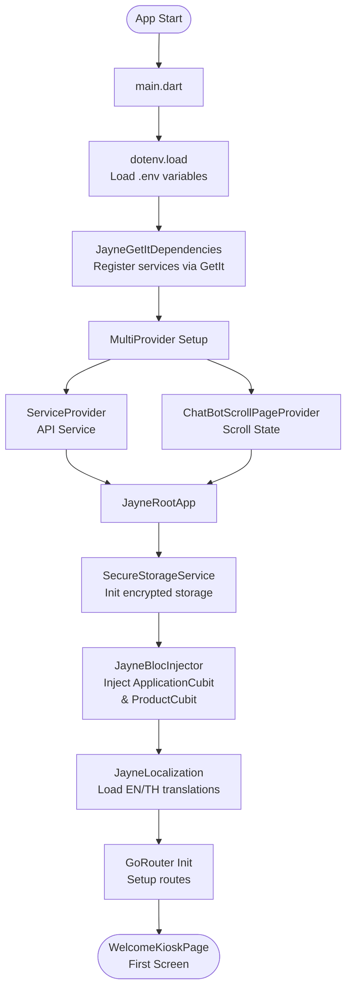
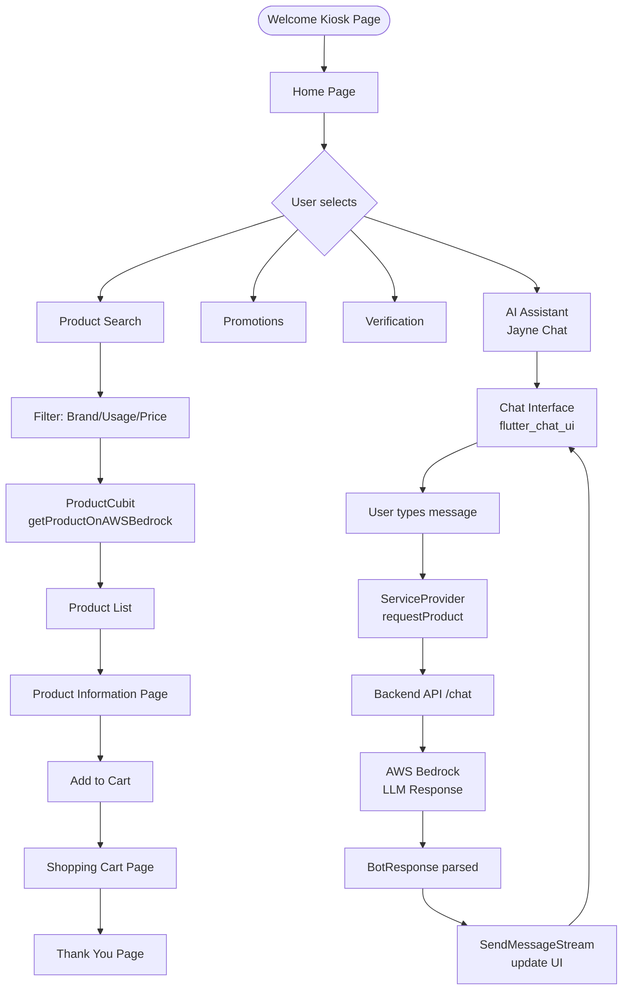
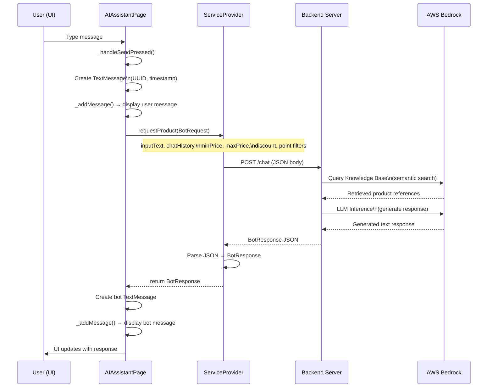
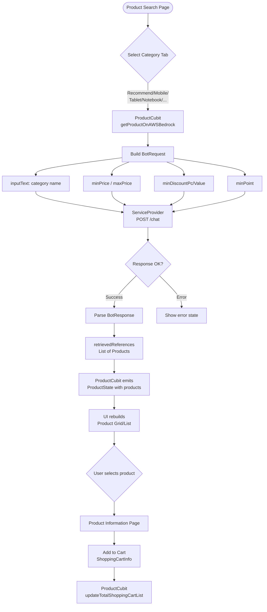
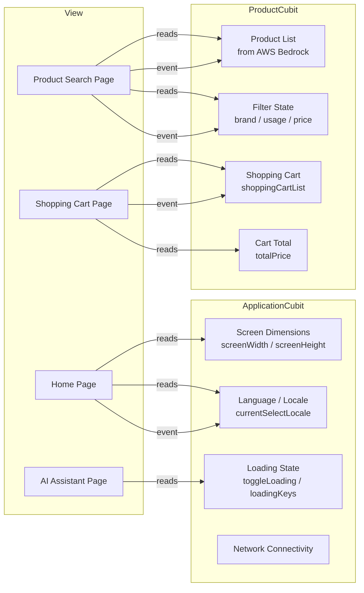
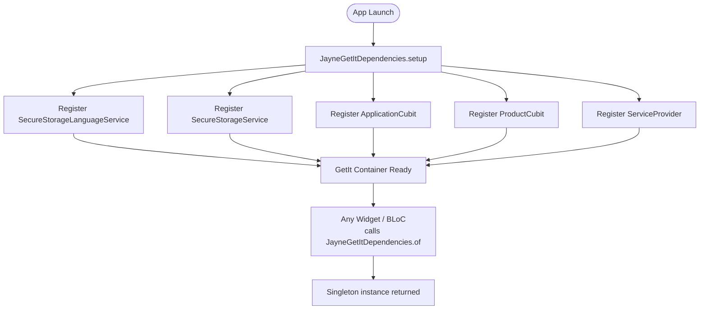
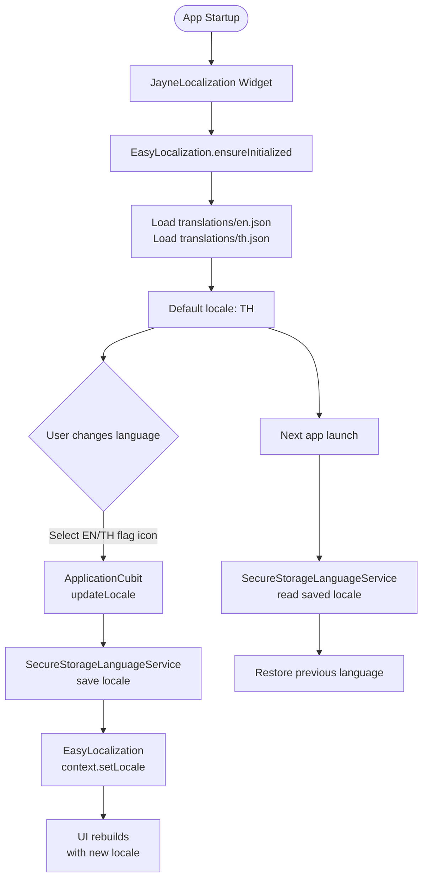

# Jenny Kiosk — GenAI Application

> Flutter-based AI-powered kiosk application for the DEPA Generative AI Hackathon
> Retail self-service platform integrated with AWS Bedrock for intelligent product recommendations

---

## Table of Contents

- [Project Overview](#project-overview)
- [Tech Stack & Libraries](#tech-stack--libraries)
- [Project Structure](#project-structure)
- [Architecture Overview](#architecture-overview)
- [Flowcharts](#flowcharts)
- [API & Backend](#api--backend)
- [Data Models](#data-models)
- [State Management](#state-management)
- [Setup & Installation](#setup--installation)

---

## Project Overview

**Jenny Kiosk** is a self-service kiosk application for Jaymart retail stores, built with Flutter and supported across iOS, Android, Web, macOS, Linux, and Windows. Users can:

- Search and browse products powered by AI (AWS Bedrock)
- Chat with AI Assistant "Jayne" for personalized product recommendations
- View promotions, verify identity, and manage their shopping cart
- Switch between 2 languages: Thai / English

---

## Tech Stack & Libraries

### Framework & Language

| Item | Details |
|------|---------|
| Framework | Flutter |
| Language | Dart ^3.5.0 |
| Platforms | iOS, Android, Web, macOS, Linux, Windows |

### State Management & DI

| Library | Version | Usage |
|---------|---------|-------|
| `flutter_bloc` | 8.1.6 | BLoC pattern for main state management |
| `bloc` | 8.1.4 | Core BLoC library |
| `provider` | 6.1.2 | Provider pattern for service injection |
| `get_it` | 7.2.0 | Service Locator / Dependency Injection |

### Navigation

| Library | Version | Usage |
|---------|---------|-------|
| `go_router` | 12.1.3 | Declarative routing and deep linking |

### UI & Animations

| Library | Version | Usage |
|---------|---------|-------|
| `flutter_chat_ui` | 1.6.15 | Chat interface components |
| `carousel_slider` | 5.0.0 | Banner carousel on Home screen |
| `lottie` | 3.1.2 | Lottie animation |
| `auto_size_text` | 3.0.0 | Responsive text sizing |
| `flutter_svg` | 2.0.10 | SVG rendering |

### Networking & Cloud

| Library | Version | Usage |
|---------|---------|-------|
| `http` | 1.2.2 | HTTP client for REST API |
| `aws_signature_v4` | 0.6.3 | AWS Signature V4 authentication |
| `aws_common` | 0.7.3 | AWS utilities |

### Authentication

| Library | Version | Usage |
|---------|---------|-------|
| `google_sign_in` | 6.2.1 | Google OAuth login |
| `flutter_facebook_auth` | 6.0.4 | Facebook login |

### Device Features

| Library | Version | Usage |
|---------|---------|-------|
| `flutter_tts` | 4.0.2 | Text-to-Speech |
| `image_picker` | ^1.1.2 | Image selection from device |
| `qr_flutter` | 4.1.0 | QR Code generation |
| `connectivity_plus` | 6.0.5 | Network connectivity detection |

### Storage & Security

| Library | Version | Usage |
|---------|---------|-------|
| `flutter_secure_storage` | 4.2.1 | Encrypted local storage |
| `shared_preferences` | 2.3.2 | Key-value lightweight storage |
| `flutter_dotenv` | 5.0.2 | Environment variables (.env) |

### Localization

| Library | Version | Usage |
|---------|---------|-------|
| `easy_localization` | 3.0.7 | Multi-language support (EN/TH) |
| `easy_localization_loader` | 2.0.2 | Load localization assets |
| `intl` | 0.19.0 | Date/Number formatting |

### Utilities

| Library | Version | Usage |
|---------|---------|-------|
| `uuid` | 4.5.1 | UUID generation for message ID |
| `url_launcher` | 6.3.1 | Open external URLs |
| `equatable` | 2.0.5 | Value equality comparison |
| `awesome_notifications` | 0.9.3+1 | Push notifications |

---

## Project Structure

```
Jenny-GenAI-Application-V1/
├── kiosk/                              # Flutter Application Root
│   ├── lib/
│   │   └── jayne/
│   │       ├── main.dart               # Entry Point
│   │       ├── jayne_getit_dependencies.dart  # Dependency Injection Setup
│   │       │
│   │       ├── blocs/                  # State Management (BLoC/Cubit)
│   │       │   ├── application_bloc/
│   │       │   │   ├── application_cubit.dart   # Global app state
│   │       │   │   └── application_state.dart
│   │       │   └── product_bloc/
│   │       │       ├── product_cubit.dart        # Product & cart state
│   │       │       └── product_state.dart
│   │       │
│   │       ├── view/                   # Screen Pages
│   │       │   ├── kiosk/              # Kiosk Mode Screens
│   │       │   │   ├── welcome_kiosk_page.dart
│   │       │   │   ├── home_page.dart
│   │       │   │   ├── product_search_page.dart
│   │       │   │   ├── product_information_page.dart
│   │       │   │   ├── promotion_page.dart
│   │       │   │   ├── verification_success_page.dart
│   │       │   │   ├── shopping_cart_page.dart
│   │       │   │   ├── ai_assistant_page.dart
│   │       │   │   └── thank_you_page.dart
│   │       │   └── chatbot/            # Chatbot Mode Screens
│   │       │       ├── splash_screen_page.dart
│   │       │       ├── welcome_chatbot_page.dart
│   │       │       ├── login_page.dart
│   │       │       ├── register_page.dart
│   │       │       ├── chat_instruction_page.dart
│   │       │       └── chat_page.dart
│   │       │
│   │       ├── components/             # UI Components (Atomic Design)
│   │       │   ├── atoms/              # Basic elements
│   │       │   │   ├── button.dart
│   │       │   │   ├── base_button.dart
│   │       │   │   ├── primary_button.dart
│   │       │   │   ├── floating_button.dart
│   │       │   │   ├── message_time.dart
│   │       │   │   ├── typing_animation.dart
│   │       │   │   └── widget_spacer.dart
│   │       │   ├── molecules/          # Atom combinations
│   │       │   │   ├── navigation/
│   │       │   │   │   └── app_bottom_navigation_bar.dart
│   │       │   │   ├── message/
│   │       │   │   │   ├── send_message.dart
│   │       │   │   │   ├── receive_message_with_profile_icon.dart
│   │       │   │   │   ├── receive_message_with_time.dart
│   │       │   │   │   └── send_message_box.dart
│   │       │   │   └── events/
│   │       │   │       └── avatar_circle.dart
│   │       │   └── organisms/          # Complex sections
│   │       │       ├── chat_panel_body.dart
│   │       │       └── loader_organism.dart
│   │       │
│   │       ├── repository/             # Data & API Layer
│   │       │   └── service_provider.dart  # REST API calls
│   │       │
│   │       ├── model/                  # Data Models
│   │       │   ├── request/
│   │       │   │   ├── bot_request.dart
│   │       │   │   └── summary_request.dart
│   │       │   └── response/
│   │       │       └── bot_response.dart
│   │       │
│   │       ├── controllers/            # Stream Controllers
│   │       │   ├── send_message_stream.dart
│   │       │   └── notification.dart
│   │       │
│   │       ├── router/                 # Navigation
│   │       │   ├── router_page.dart
│   │       │   └── routes_name.dart
│   │       │
│   │       ├── providers/              # State Providers
│   │       │   └── chatbot_scroll_page_provider.dart
│   │       │
│   │       ├── enhances/               # Utility Enhancements
│   │       │   ├── responsive_text.dart
│   │       │   ├── responsive_image.dart
│   │       │   ├── responsive_element_functions.dart
│   │       │   ├── condition.dart
│   │       │   └── focus_cleaner.dart
│   │       │
│   │       ├── common/                 # Shared Constants & Styles
│   │       │   ├── app_styles.dart
│   │       │   ├── theme_color.dart
│   │       │   ├── default_color.dart
│   │       │   ├── action.dart
│   │       │   └── message_type.dart
│   │       │
│   │       ├── layouts/                # Layout Wrappers
│   │       │   ├── jayne_scaffold_layout.dart
│   │       │   ├── popup_layout.dart
│   │       │   ├── popup_container.dart
│   │       │   ├── background_gradient.dart
│   │       │   ├── image_filter_blur.dart
│   │       │   └── widget_size.dart
│   │       │
│   │       ├── language/               # Localization
│   │       │   ├── language_handler.dart
│   │       │   └── th_custom_intl.dart
│   │       │
│   │       ├── secure_storage/         # Encryption & Storage
│   │       │   └── secure_storage_service.dart
│   │       │
│   │       └── utils/                  # Utility Functions
│   │           ├── condition_functions.dart
│   │           └── user_data.dart
│   │
│   ├── assets/
│   │   ├── images/                     # Image & Icon Assets
│   │   └── fonts/
│   │       ├── THSarabun.ttf
│   │       ├── THSarabun_Bold.ttf
│   │       └── THSarabun_Bold_Italic.ttf
│   │
│   ├── translations/                   # i18n Files
│   │   ├── en.json                     # English
│   │   ├── th.json                     # Thai
│   │   └── metadata.json
│   │
│   ├── test/
│   │   └── widget_test.dart
│   │
│   ├── pubspec.yaml                    # Dependencies
│   ├── .env                            # Production Environment
│   └── env-dev                         # Development Environment
│
└── README.md
```

---

## Architecture Overview

```
┌─────────────────────────────────────────────────────────────────────┐
│                         PRESENTATION LAYER                          │
│                                                                     │
│   ┌──────────────────────────────────────────────────────────────┐  │
│   │                    VIEW (Screens / Pages)                    │  │
│   │  WelcomePage → HomePage → ProductSearch / AIAssistant / ...  │  │
│   └──────────────────────────────────────────────────────────────┘  │
│                               ▲ │                                   │
│                         read  │ │ emit events                       │
│                               │ ▼                                   │
│   ┌──────────────────────────────────────────────────────────────┐  │
│   │              STATE MANAGEMENT (BLoC / Cubit)                 │  │
│   │          ApplicationCubit          ProductCubit              │  │
│   │  (Screen size, language, loading)  (Products, cart, filters) │  │
│   └──────────────────────────────────────────────────────────────┘  │
│                               ▲ │                                   │
│                      request  │ │ response                          │
│                               │ ▼                                   │
│   ┌──────────────────────────────────────────────────────────────┐  │
│   │                  REPOSITORY LAYER                            │  │
│   │                   ServiceProvider                            │  │
│   │           (HTTP calls → REST API /chat)                      │  │
│   └──────────────────────────────────────────────────────────────┘  │
└────────────────────────────────────────┬────────────────────────────┘
                                         │ HTTP POST
                                         ▼
┌─────────────────────────────────────────────────────────────────────┐
│                          BACKEND SERVER                             │
│               http://184.72.103.175:5000/chat                       │
│                                                                     │
│   ┌─────────────────────────────────────────────────────────────┐   │
│   │                     Python Backend                          │   │
│   │              (LLM Orchestration Layer)                      │   │
│   └───────────────────────────┬─────────────────────────────────┘   │
│                               │                                     │
│                               ▼                                     │
│   ┌─────────────────────────────────────────────────────────────┐   │
│   │                    AWS Bedrock                               │   │
│   │         (Knowledge Base + LLM Model)                        │   │
│   │   - Product catalog embeddings                              │   │
│   │   - Semantic search & recommendations                       │   │
│   └─────────────────────────────────────────────────────────────┘   │
└─────────────────────────────────────────────────────────────────────┘
```

### Layer Responsibilities

| Layer | Responsibility |
|-------|---------------|
| **View** | Renders UI, receives user input, listens to state changes |
| **BLoC/Cubit** | Manages business logic, state transitions, orchestrates data flow |
| **Repository** | HTTP calls, serialize/deserialize JSON, error handling |
| **Backend** | LLM orchestration, prompt engineering, AWS Bedrock integration |
| **AWS Bedrock** | Vector search on product catalog, LLM inference |

---

## Flowcharts

### 1. Application Startup Flow



---

### 2. Main Navigation Flow (Kiosk Mode)



---

### 3. AI Chat Message Flow



---

### 4. Product Search Flow



---

### 5. State Management Flow



---

### 6. Dependency Injection (GetIt) Flow



---

### 7. Localization Flow



---

## API & Backend

### Base URL
```
http://184.72.103.175:5000
```

### POST `/chat` — Product Recommendation & Chat

**Request Body:**
```json
{
  "input_text": "Recommend a phone under 15000",
  "chat_history": [
    {
      "role": "user",
      "content": "Hello"
    },
    {
      "role": "bot",
      "content": "Hi there! How can I help you?"
    }
  ],
  "min_price": 0,
  "max_price": 15000,
  "min_discount_pc": 0,
  "min_discount_value": 0,
  "min_point": 0
}
```

**Response Body:**
```json
{
  "messageType": "product",
  "output": "I recommend the iPhone 15 priced at 29,900 THB...",
  "retrieved_references": [
    {
      "content": "product detail text",
      "metadata": {
        "code": "SKU-001",
        "original_price": 29900.0,
        "discounted_price": 27900.0,
        "discount_%": 6.7,
        "discount_value": 2000.0,
        "point": 279.0,
        "image_0": "https://...",
        "image_1": "https://...",
        "image_2": "https://...",
        "product_url": "https://...",
        "x-amz-bedrock-kb-chunk-id": "...",
        "x-amz-bedrock-kb-data-source-id": "...",
        "x-amz-bedrock-kb-source-uri": "..."
      }
    }
  ]
}
```

---

## Data Models

### BotRequest
```dart
class BotRequest {
  String inputText;              // User query / message
  List<ChatHistory> chatHistory; // Conversation history
  int minPrice;                  // Minimum price filter
  int maxPrice;                  // Maximum price filter
  int minDiscountPc;             // Minimum discount percentage
  int minDiscountValue;          // Minimum discount amount
  int minPoint;                  // Minimum loyalty points
}

class ChatHistory {
  String role;    // "user" or "bot"
  String content; // Message text
}
```

### BotResponse
```dart
class BotResponse {
  String output;                             // AI-generated response text
  String messageType;                        // Message type
  List<RetrievedReferences> retrievedReferences; // Product list
}

class RetrievedReferences {
  String content;
  Metadata metadata;
}

class Metadata {
  String code;
  double originalPrice, discountedPrice;
  double discountPc, discountValue, point;
  String image0, image1, image2;
  String productUrl;
}
```

### ProductInfo & ShoppingCartInfo
```dart
class ProductInfo {
  List<String> images;
  String imageUrl, brandName, color, detail;
  double price;
}

class ShoppingCartInfo {
  String imageUrl, brandName, storage, color;
  int quantity;
  double price;
}
```

---

## State Management

### ApplicationCubit — Global App State

| State Property | Type | Description |
|---------------|------|-------------|
| `screenWidth` | double | Screen width |
| `screenHeight` | double | Screen height |
| `currentSelectLocale` | Locale | Selected language (en/th) |
| `toggleLoading` | bool | Global loading overlay state |
| `loadingKeys` | Map | Granular loading per feature |

### ProductCubit — Product & Cart State

| State Property | Type | Description |
|---------------|------|-------------|
| `productList` | List\<ProductInfo\> | Product list from API |
| `selectedBrand` | String | Brand filter |
| `selectedUsage` | String | Usage filter |
| `minPrice` / `maxPrice` | int | Price range filter |
| `shoppingCartList` | List\<ShoppingCartInfo\> | Items in cart |
| `totalPrice` | double | Total cart price |

---

## Design System

### Color Palette

| Group | Color | Hex |
|-------|-------|-----|
| Primary | Red | `#B8232F` |
| Primary | Yellow | `#FFCE00` |
| Background | White | `#FFFFFF` |
| Text | Black | `#000000` |

### Typography

| Style | Size | Weight |
|-------|------|--------|
| Header | 21px | Bold |
| Title1 | 18px | Bold |
| Title2 | 16px | SemiBold |
| Body1 | 16px | Regular |
| Caption | 14px | Regular |
| Small | 12px | Regular |

**Font Family:** THSarabunPSK (Thai Sarabun)

### Responsive Breakpoints

| Breakpoint | Width |
|-----------|-------|
| XS | 320px |
| S | 375px |
| L | 430px |
| XL | 820px |

---

## Setup & Installation

### Prerequisites
- Flutter SDK >= 3.5.0
- Dart SDK >= 3.5.0
- Xcode (for iOS/macOS)
- Android Studio (for Android)

### Installation

```bash
# 1. Clone repository
git clone <repository-url>
cd Jenny-GenAI-Application-V1/kiosk

# 2. Install dependencies
flutter pub get

# 3. Setup environment variables
cp env-dev .env
# Edit values in .env as needed

# 4. Run application
flutter run

# Run on a specific platform
flutter run -d ios
flutter run -d android
flutter run -d macos
flutter run -d web
```

### Environment Variables (`.env`)

```env
IMAGE_PATH=assets/images
TRANSLATION_PATH=translations
```

### Build

```bash
# Build for iOS
flutter build ios --release

# Build for Android
flutter build apk --release
flutter build appbundle --release

# Build for Web
flutter build web --release

# Build for macOS
flutter build macos --release
```

---

## Route Map

| Route | Page | Description |
|-------|------|-------------|
| `/` | WelcomeKioskPage | Welcome screen |
| `/home` | HomePage | Main screen with 4 menu options |
| `/product_search` | ProductSearchPage | AI-powered product search |
| `/product_information` | ProductInformationPage | Product detail |
| `/promotion` | PromotionPage | Promotions screen |
| `/verification_success` | VerificationSuccessPage | Identity verification success |
| `/shopping_cart` | ShoppingCartPage | Shopping cart |
| `/ai_assistant` | AIAssistantPage | Chat with Jayne AI |
| `/thank_you` | ThankYouPage | Thank you screen |

---

## Component Architecture (Atomic Design)

```
components/
├── atoms/          # Building blocks
│   ├── Button variants (Base, Primary, Floating)
│   ├── TypingAnimation (shown while AI is responding)
│   ├── MessageTime
│   └── WidgetSpacer
│
├── molecules/      # Atom combinations
│   ├── message/    (SendMessage, ReceiveMessage)
│   ├── navigation/ (AppBottomNavigationBar)
│   └── events/     (AvatarCircle)
│
└── organisms/      # Complex UI sections
    ├── ChatPanelBody   (Full chat panel)
    └── LoaderOrganism  (Loading states)
```

---

*Built for DEPA Generative AI Hackathon — Powered by Flutter & AWS Bedrock*
